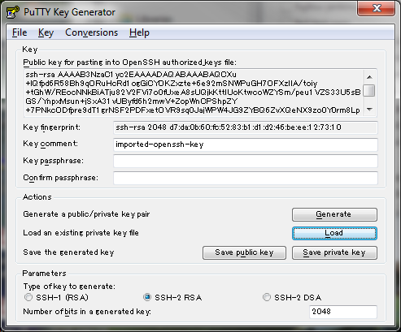

**Procedure
to create pio environment on AWS without using CFT**

 

Date:
Aug.20 2015

**1.  
****Create instances**

  
Create below 4 instances: (depends on customer request)

     → watch-Nginx
(t2-micro)

     → ES-MySQL-Master
(m3-large)

     → NFS-Web (m3-medium)

     → MySQL-Slave
(t2-micro)

   General
setup for all server: (OS:redhat 6.5, security group name: hcl-sg-mysql,  Key name: test_unit)

※  hcl-sg-mysql is
configured like following

| **Type**        |      **Protocol**      |  **Port Range** |  **Source** |
|-----------------|:----------------------:|----------------:|------------:|
| HTTP            |  TCP                   | 80              | 0.0.0.0/0   |
| MYSQL/Aurora    |  TCP                   | 3306            | 0.0.0.0/0   |
| Custom TCP Rule |  TCP                   | 9300            | 0.0.0.0/0   |
| Custom TCP Rule |  TCP                   | 9200            | 0.0.0.0/0   |
| SSH             |  TCP                   | 22              | 0.0.0.0/0   |
| Custom ICMP Rule|  Echo Request          | N/A             | 0.0.0.0/0   |

※  test_unit is the
key-pair which was created earlier.

    

---------------------------------------
GETTING STARTED 

## Server setup :white_check_mark:

* Item 1
* Item 2
  * Item 2a
  * Item 2b
  

- [x] @mentions, #refs, [links](), **formatting**, and <del>tags</del> supported
- [x] list syntax required (any unordered or ordered list supported)
- [x] this is a complete item
- [ ] this is an incomplete item

[link to Google!](http://google.com)
